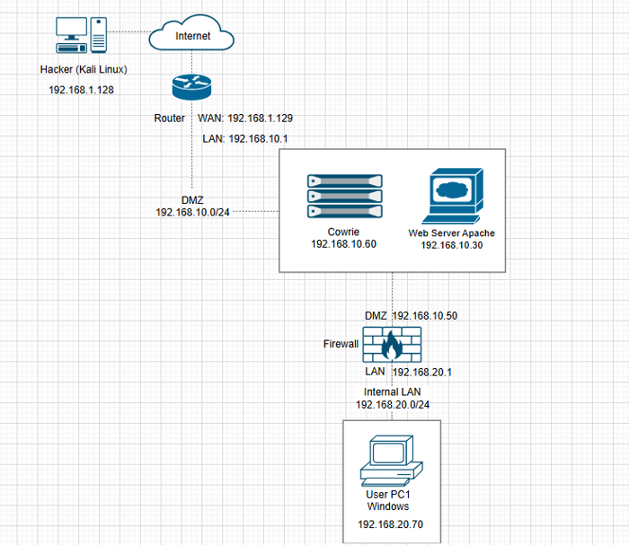

# Honeypot lab
## Giới thiệu
Dự án triển khai môi trường Honeypot sử dụng VMware, pfSense và Cowrie nhằm mô phỏng và giám sát hành vi tấn công mạng.
## Mục tiêu
Xây dựng và triển khai một hệ thống Honeypot sử dụng Cowrie nhằm giả lập dịch vụ SSH để ghi nhận các hành vi truy cập trái phép. Thông qua đó, hệ thống giúp quan sát các hoạt động tấn công trong môi trường mạng mô phỏng, hỗ trợ việc giám sát và nâng cao khả năng bảo vệ hệ thống.
## Công nghệ sử dụng
- VMware
- pfSense
- Cowrie
- Kali Linux
## Chức năng
- Chuyển hướng lưu lượng bằng NAT và Port Forward
- Ghi nhận hành vi attacker
- Thu thập log truy cập SSH
## Mô hình triển khai
Attacker (Kali Linux)  
↓  
pfSense  
↓  
Cowrie Honeypot  

## Kết quả
- Triển khai thành công môi trường Honeypot trên máy ảo
- Ghi nhận các lần đăng nhập SSH mô phỏng
.png)
- Thu thập log phục vụ phân tích hành vi tấn công
.png)
## Vid Demo
[Xem video demo tại đây]https://drive.google.com/file/d/1YqvRkiQ5iLIt9i8bi5QN_-w6j3y-6vRS/view?usp=sharing
